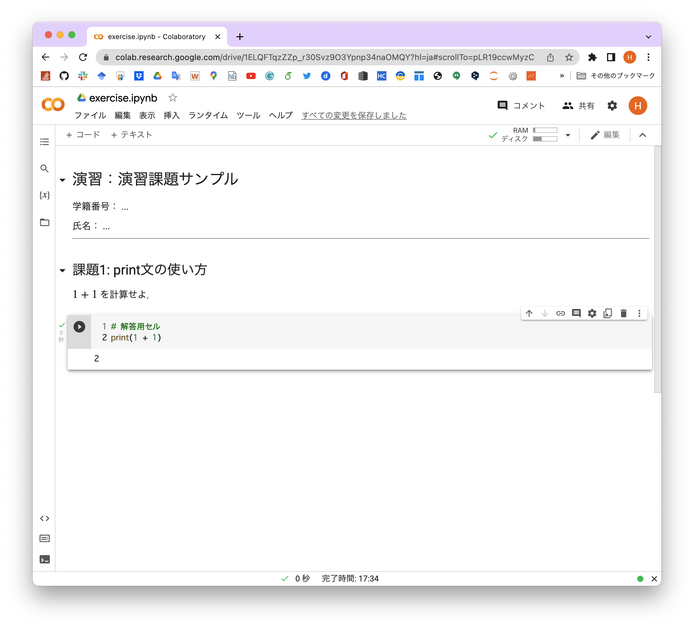
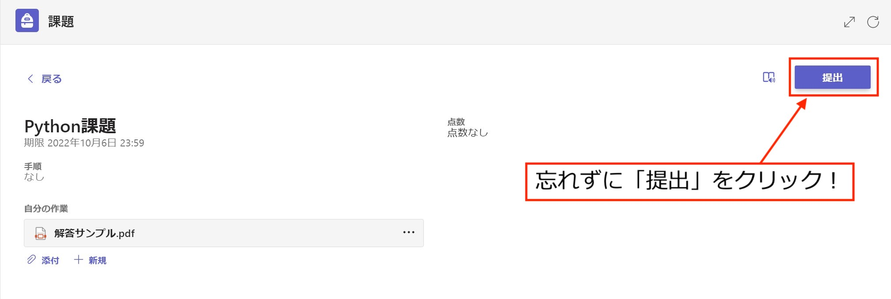

# 課題提出方法

「ゼロからはじめるプログラミング」では，[成績評価](../../intro.html#id6)にも記載の通り毎週の課題提出状況と期末試験の成績から総合的に評価します．このページでは課題ファイルの作成・提出方法を説明します．

## 課題提出の流れ

課題の提出は以下の手順で行います．

1. 月曜日に演習課題が掲載されると同時に， **Teams** 上で課題提出フォームが公開されます．
2. 演習回の教材から課題ファイルを取得し，課題を解いてください．
3. 解いた課題ファイル (.ipynb形式) を **PDF** ファイル (.pdf形式)に変換してください．
4. Teamsの課題提出フォームから，課題のPDFファイルを期限までに提出してください．

`````{admonition} 課題提出時の注意
:class: warning
- 提出を受け付けるのはPDFファイルのみです．
  - .ipynbファイルの提出は受け付けませんので，必ず変換してから提出してください．
- ファイルの冒頭に学籍番号と氏名を記載することを忘れないようにしてください．
- 提出締め切りを過ぎるとアップロードできません．
`````

各手順の詳細は以下に続きます．

---

## 1. Teamsにおける課題提出フォームの公開

1. Teams上で課題提出フォームが作成されると **一般チャンネル** に以下のようなメッセージが通知されます．

    

2. 通知されたメッセージの課題の表示をクリックすると以下の提出フォームが表示されます．このフォームはTeams左側のメニューの「課題」からもアクセスできます（課題の提出方法は[後述](#id5)します）．

    


## 2. 課題ファイルの取得と解答

1. まず課題のファイルを取得します．サポートページから，演習回の教材を開いてください．以下の2通りの方法があります．

    1. **ロケットマークからGoogle Colabを直接開く方法**
    
        画面上部のロケットマーク → Colab をクリックすると，演習回の教材がGoogle Colaboratoryで開かれます．これを課題ファイルとして利用してください．

        開き方の詳細は [Google Colaboratoryを使った教材の開き方](https://ground-zero-programming.github.io/zero-pro2022-public/docs/01/introduction_and_setup.html#id6) に記載されています．
    
        `````{admonition} 注意
        :class: warning
        ロケットマークから開いたままの状態では，課題ファイルに加えた編集は保存されないため，ブラウザのタブを閉じると作業内容が消えてしまいます．ノートブックの上側にある「ドライブをコピー」というボタンを押して，**自分のGoogle Drive上に課題ファイルのコピーを作成してから解答することを強く推奨**します．
        `````


    2. **教材を一度ダウンロードしてColabにアップロードする方法**
    
        ロケットマークのアイコンなどが並んだ画面上部の右端のアイコンをクリックすると，演習回の教材をノートブックファイル (.ipynb形式) としてダウンロードできます．
        ダウンロードした教材を改めてGoogle Colaboratoryにアップロードし，これを課題ファイルとして利用してください．
        
        アップロード手順は [ノートブックのアップロード](https://ground-zero-programming.github.io/zero-pro2022-public/docs/01/introduction_and_setup.html#id5) に記載されています．

2. 上記の手順で演習課題の .ipynb ファイルをGoogle Colabで開くと，ノートブックの最上部に学籍番号と氏名の記入欄がテキストセルとして用意してあります．**必ずこのセルを編集し，学籍番号と氏名を記入してください．**

    

3. 用意された解答用セルを利用し，各課題を解いてください．必ずしも一つの解答用セルにプログラムを作成する必要はありません．

    

4. どうしても解けない課題があった場合，その課題の解答用セルは空欄のままでも構いません．ただし，あまりにも空欄が多い場合は評価に影響しますので，注意してください．

## 3. 課題ファイルの変換

解き終わった課題ファイルは，**提出前に必ず下記の手順でPDFファイルに変換**してください．

1. Google Colaboratoryのメニューバーから「ファイル」を選択し，**印刷** をクリックしてください．

    

2. 印刷プレビュー画面からPDFファイルを出力します．具体的な手順はブラウザごとに異なるので，以下から選択してください．

    ```{dropdown} Google Chrome の場合

    プレビュー画面右側の「送信先」をクリックすると利用可能なプリンターに加えて「PDFに保存」という項目があるはずなので選択し，右下の **保存** をクリックしてください．

    
    ```


    ```{dropdown} Microsoft Edge の場合
   プレビュー画面左側の「プリンター」の選択肢から「PDFとして保存」を選択し，左下の **保存** をクリックしてください．

    

    
    ```

    ```{dropdown} Safari の場合
    プレビュー画面中央下付近にある「PDF」をクリックし，表示された選択肢から **PDFを保存** をクリックしてください．

    

    ```

3. 以上の手順より，パソコンにPDFファイルが保存されるはずです．保存場所とファイル名はわかりやすいように各自設定してください．保存されたPDFファイルが以下のように正しく出力されていることを確認してください．

    


## 4. 課題ファイルの提出

1. Teamsの課題提出フォームを開いてください（[1.で説明した手順](#teams) を参照）．左下の **添付** をクリックし，解答済みの課題ファイル (.pdf形式) を **自身のデバイス** からアップロードしてください．

    

2. アップロードしたファイルが「自分の作業」のところに表示されているのを確認し，右上の **提出** をクリックしてください．

    

    `````{admonition} 注意
    :class: warning
    アップロードしただけでは提出にはなりません．必ず「提出」ボタンをクリックしてください．
    `````

3. 提出が正常に完了すると，右上に **提出しました** という表示が出ます．期限内であれば，提出を取り消して新たな解答ファイルをアップロードすることも可能です．

    

---

